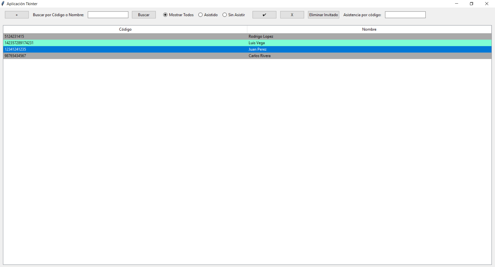

# Aplicación para el Acceso a Eventos

Esta es una aplicación de escritorio desarrollada en Python utilizando Tkinter para gestionar el acceso a eventos mediante códigos de identificación, que pueden ser códigos de barras o QR. Permite la administración de la asistencia de invitados y el registro de nuevos usuarios.

## Características

- **Agregar nuevos invitados**: Permite añadir usuarios nuevos al evento ingresando su código y nombre.
- **Buscar invitados**: Función para buscar invitados por código o nombre.
- **Registrar asistencia**: Marcar a un usuario como asistido o no asistido.
- **Filtrar por asistencia**: Visualizar todos los invitados, solo los que asistieron o los que no asistieron.
- **Eliminar invitados**: Posibilidad de eliminar un invitado del registro.

## Requisitos

Asegúrate de tener Python 3.x instalado en tu máquina. También necesitas instalar las siguientes bibliotecas antes de ejecutar la aplicación:

- `tkinter` (suele venir por defecto con Python, pero en algunas distribuciones, puede requerir instalación adicional)
- `json` (incluido en la biblioteca estándar de Python)
- `os` (incluido en la biblioteca estándar de Python)
- `functools` (incluido en la biblioteca estándar de Python)

## Instalación

1. **Clonar el repositorio:**

   ```bash
   git clone https://github.com/tuusuario/nombre-repo.git
   cd nombre-repo
   ```

2. **Instalar los requerimientos:**

   Ejecuta el siguiente comando para instalar las bibliotecas necesarias desde el archivo `requirements.txt`:

   ```bash
   pip install -r requirements.txt
   ```

   Si estás en un entorno virtual (recomendado), asegúrate de activarlo antes de instalar los requisitos.

## Uso

1. **Ejecutar la aplicación:**

   Simplemente ejecuta el archivo principal `main.py` (o el nombre del archivo donde está contenido tu código):

   ```bash
   python main.py
   ```

2. **Interfaz de Usuario:**

   - **Añadir Invitado:** Haz clic en el botón "+" para abrir una ventana donde puedes ingresar un nuevo invitado con su código y nombre. Pulsa "Aceptar" para guardar.
   - **Buscar Invitado:** Usa la barra de búsqueda para filtrar invitados por nombre o código.
   - **Marcar Asistencia:** Selecciona un invitado de la lista y utiliza el botón ✔ para marcar como asistido o X para marcar como no asistido.
   - **Eliminar Invitado:** Selecciona un invitado de la lista y presiona "Eliminar Invitado" para quitarlo del registro.

3. **Filtrar por Asistencia:**

   - **Mostrar Todos:** Muestra todos los registros, independientemente del estado de asistencia.
   - **Asistido:** Muestra solo los invitados que han asistido al evento.
   - **Sin Asistir:** Muestra solo los invitados que no han asistido.

## Archivos

- **`main.py`**: Código fuente de la aplicación.
- **`data/registros.json`**: Archivo JSON donde se almacenan los registros de los invitados.
- **`requirements.txt`**: Lista de dependencias requeridas para la aplicación.

## Estructura del Archivo JSON

El archivo `data/registros.json` contiene una lista de objetos con la siguiente estructura:

```json
[
  {
    "Codigo": "ID001",
    "Nombre": "Juan Pérez",
    "Asistencia": true
  },
  {
    "Codigo": "ID002",
    "Nombre": "Ana Gómez",
    "Asistencia": false
  }
]
```

## Dependencias

Aquí tienes un ejemplo del contenido de `requirements.txt`:

```plaintext
# tkinter no se instala con pip ya que es parte de la biblioteca estándar de Python
```

## Capturas de Pantalla


*Interfaz principal de la aplicación mostrando la lista de invitados.*

## Contribuciones

Las contribuciones son bienvenidas. Siéntete libre de abrir un "issue" o un "pull request" en el repositorio.

## Licencia

Este proyecto está bajo la Licencia MIT - mira el archivo [LICENSE](LICENSE) para más detalles.

## Contacto

Para cualquier pregunta o soporte, por favor contacta a: [tuemail@example.com](mailto:tuemail@example.com)
